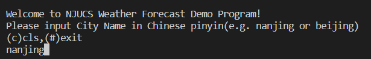
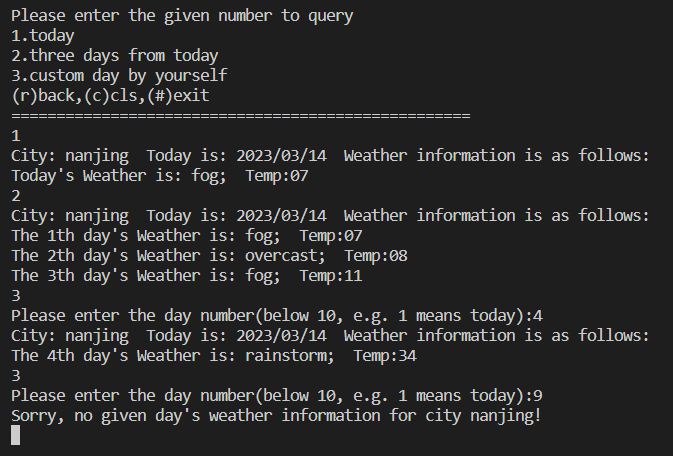

# 实验2 逆向工程套接字编程实验 实验报告
#### 201840058 蒋潇鹏
## 实验目的
理解协议的逆向分析方法并掌握客户端套接字编程
## 实验内容
设计思路：通过抓包，发现了程序的运行流程：
- 存在两个界面：
  1. 界面一，读取一个城市名，发送给server. 收到rcvpkt后，检查返回值，是1则输出input error, 是2则进入界面二
  2. 界面二，读取询问天气类型，是1，2则直接向server发送，是3则再次询问查询日期。之后向server发包，并显示天气信息结果。
- 设计接收包/发送包结构体如下：
```C++
// 发送报文的格式
struct SendPacket {
    char page, query_type; // 分别表示位于哪一个page, 询问类型
    char data[SEND_DATA_LEN]; // 传输询问的城市名称
    char day_num; // 传输询问的日期
} __attribute__((aligned(1)));

// 接收报文的格式
struct RecvPacket {
    char retval, reply_type; // 返回值，返回的询问类型
    char data[SEND_DATA_LEN]; // 传输城市名称
    char date[4]; // 传输当前日期
    char day_num; // 传输日期数量
    char weather[6]; // 传输天气/温度信息
    char useless[84]; // 占位
} __attribute__((aligned(1)));
```

## 实验中遇到的问题与解决方案
在抓包的时候，遇到了同样的行为发不同的包的情况。后来发现，是因为修改的时候原程序不会将缓冲区置为0，因此一些不影响语义的部分还会保留在缓冲区中。

## 实验结果
成功运行：



隐藏的flag:
1. 在询问天气时，会发现0x08对应的天气在client中输出为"Please guess: ZmxhZ3tzYW5kX3N0MHJtfQ==", 经过base64解码可以发现flag是sand_st0rm
2. 在接收到的包中可以发现一些由 .- 组成的字符串，经过摩尔斯电码解密后发现是FINDME
## 实验的启示/意见和建议
在本次实验中，我学会了在linux下用socket编程，增强了抓包分析的能力，同时还通过信息检索学到了诸如base64, 摩尔斯电码等编码方式。 

本次实验用时：7h, 其中学习时间2h, 抓包时间1h, 写代码+测试时间4h